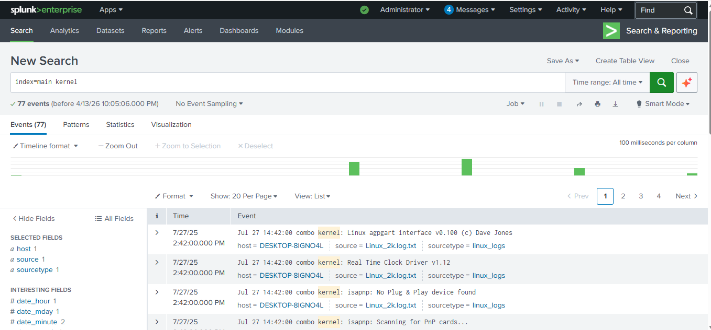
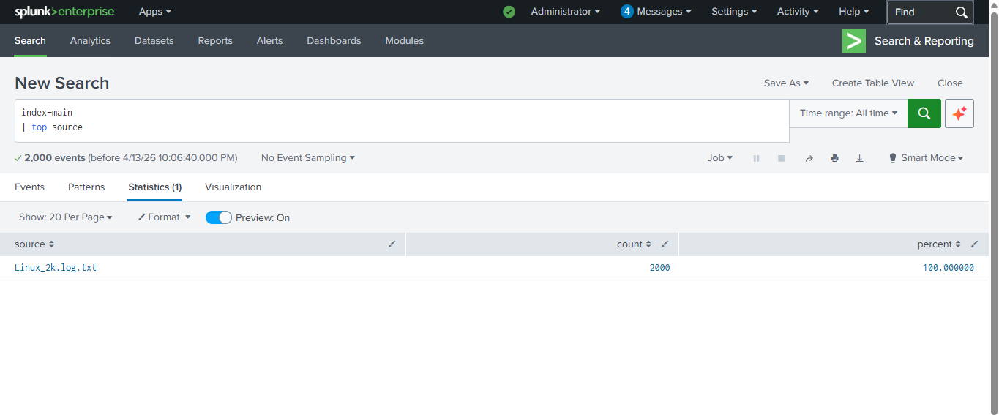
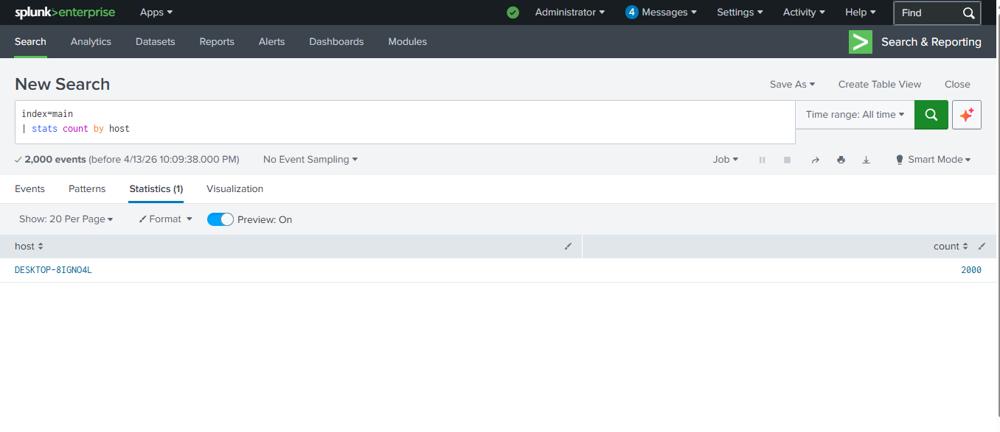
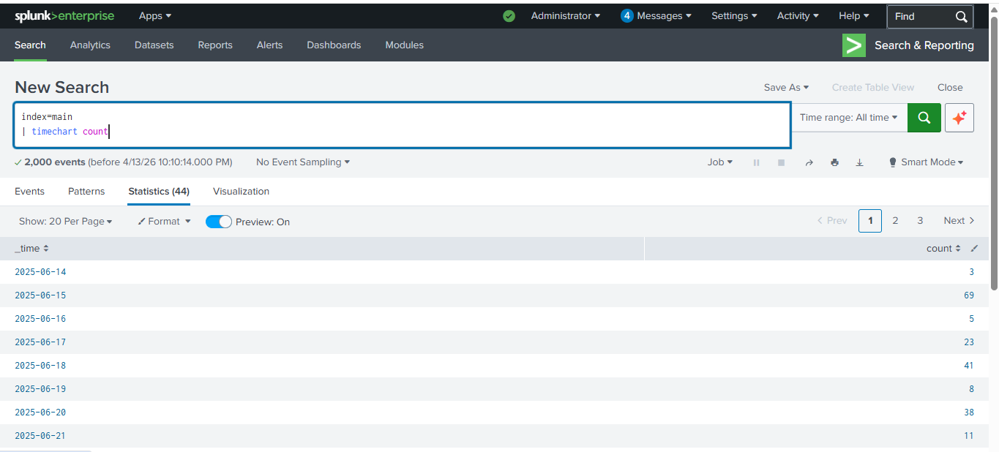

# SOC Alert Detection Lab using Splunk

## Project Overview

This project demonstrates how a Security Operations Center (SOC) analyst uses Splunk SIEM to analyze logs and detect suspicious system activity.

The investigation focuses on analyzing Linux system logs to identify abnormal behavior, monitor system events, and understand how alerts can be created from log data.

This lab simulates a real SOC workflow including:

• Log ingestion
• Log analysis
• Event investigation
• Detection of suspicious activity patterns

---

## Tools Used

* Splunk Enterprise (SIEM Platform)
* Linux System Log Dataset
* Splunk Search Processing Language (SPL)

---

## Project Objectives

* Import log data into Splunk
* Analyze system logs using SPL queries
* Identify log sources generating events
* Analyze host activity
* Investigate event timelines
* Understand SOC alert detection workflow

---

## Data Ingestion

Linux system logs were uploaded into Splunk using the **Add Data → Upload** feature.

The logs were indexed into the **main index** and analyzed using Splunk queries.

Dataset used:

```
Linux_2k.log.txt
```

---

## Splunk Queries Used

### 1. Kernel Activity Analysis

```id="s4cztf"
index=main kernel
```

This query filters kernel related system events and helps identify system-level activity.

---

### 2. Identify Top Log Sources

```id="2n8g9v"
index=main
| top source
```

This query identifies which log file generated the most events.

---

### 3. Host Activity Analysis

```id="ysu1gy"
index=main
| stats count by host
```

This query identifies which system generated the log events.

---

### 4. Event Timeline Analysis

```id="8k1g3q"
index=main
| timechart count
```

This query creates a timeline of events to visualize log activity over time.

---

## Investigation Screenshots

### Kernel Activity Analysis



---

### Top Log Source Analysis



---

### Host Activity Analysis



---

### Event Timeline Analysis



---

## Investigation Findings

During the investigation, Linux system logs were analyzed using Splunk SIEM.

Key observations:

• The log source generating events was identified.
• System host activity was analyzed using SPL queries.
• Event activity over time was visualized using timechart.

These techniques help SOC analysts monitor system behavior and detect suspicious patterns.

---

## Skills Demonstrated

* SIEM Log Analysis
* Security Monitoring
* Splunk SPL Queries
* Event Investigation
* SOC Workflow

---

## Conclusion

This project demonstrates how Splunk SIEM can be used to analyze system logs and monitor security events.

Through log analysis and visualization techniques, SOC analysts can detect suspicious activity and investigate potential security incidents.

---

## Author

Vivek Sharma
Cybersecurity Enthusiast

GitHub:
https://github.com/vivek-sh45

LinkedIn:
https://www.linkedin.com/in/vivek-sharma-370741392/
